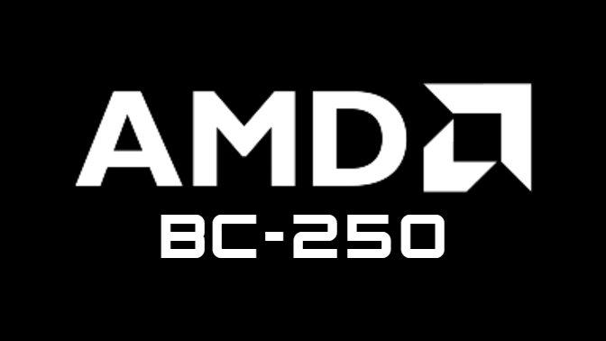
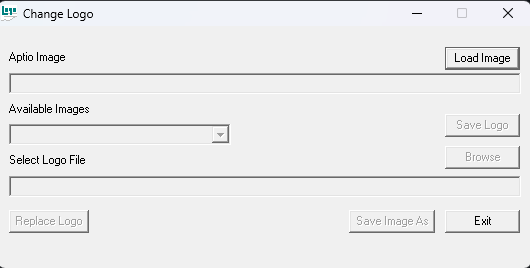

# bc250-custom-bios-logo
BC250 BIOS custom boot logo theme — AMI OEM tool “ChangeLogo.exe” included for DIY logo modification

# AMD BC-250 Custom AMI BIOS Logo

The ROM file still contains the **unlocked chipset menu of P3.00**, it just comes with the custom boot logo I made.

You can make your own custom logo as well using AMI's software "CustomLogo.exe".

VirusTotal: https://www.virustotal.com/gui/file/aacf50e75f8c954047e93986315fc25cfa4619697c2f32f04889646c59fcdbd3

# How to use AMI Change Logo Tool 

AMI Change Logo Tool should work on any American Megatrends-based BIOS, like ASUS, ASRock, Gigabyte, MSI, and others.

1.	Click **Load Image** and select the BIOS .rom file you want to modify.
2.	Click **Browse** under Save Image and choose a BMP image you want to use as the logo.
3.	Click **Replace Logo** — that’s it!

# Logo Format Recommendations

From my experience, the best image logo format is:

BMP File Format

24-bit bit depth

672 × 378 (16:9)

96 DPI

Use black backgrounds — don’t use transparent backgrounds because it could cause visual glitches in the logo itself.

# Disclaimer

This project is for cosmetic purposes only and doesn’t affect performance.

Use at your own risk — use a hardware programmer (e.g., CH341A or Raspberry Pi) for recovery purposes.
